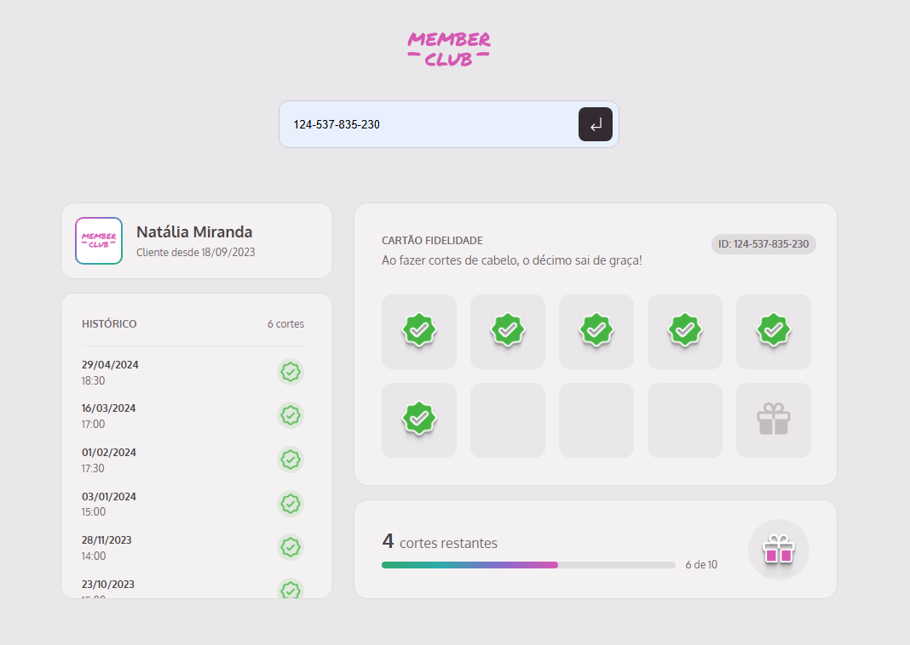
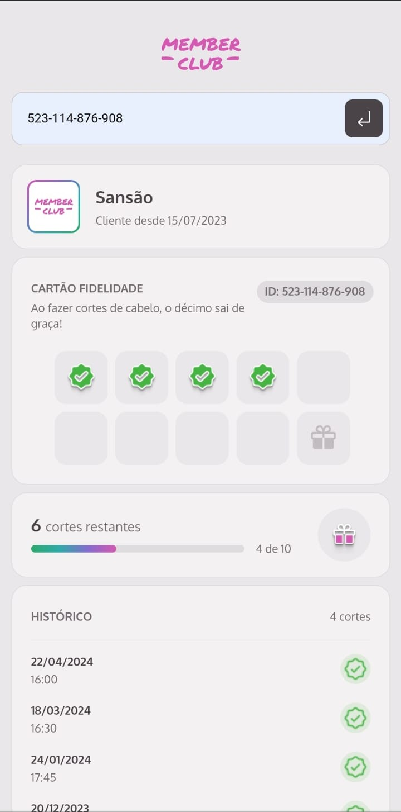

# Cartão Fidelidade Digital

## 📋 Sobre o Projeto

Este projeto foi desenvolvido como parte do MBA Full-stack da Rocketseat e Sirius. Trata-se de um sistema de cartão fidelidade digital onde é possível consultar o histórico de cortes de cabelo dos clientes e acompanhar seu progresso até ganhar o décimo corte gratuitamente.

## 🚀 Tecnologias Utilizadas

- HTML
- CSS
- JavaScript
- JSON Server
- Babel
- Webpack

## 🔧 Instalação

1. Clone este repositório
2. Instale as dependências:

```bash
npm install
```

## ⚙️ Executando o Projeto

Para iniciar o servidor de desenvolvimento:

```bash
npm run dev
```

Para iniciar o JSON Server (necessário para funcionamento do backend):

```bash
npm run server
```

Para gerar a build de produção:

```bash
npm run build
```

## 📱 Como Usar

Para testar o sistema, você pode utilizar os seguintes IDs de cartão:

- 124-537-835-230
- 207-245-699-104
- 523-114-876-908

Basta inserir um destes IDs no campo de busca para visualizar o histórico do cliente e seu progresso.

## 📸 Screenshots

### Histórico do Cliente




## 🎯 Funcionalidades

- Busca de clientes por ID do cartão
- Visualização do histórico de cortes
- Acompanhamento do progresso até o décimo corte gratuito
- Interface responsiva e intuitiva

## 🛠️ Estrutura do Projeto

```
member-club/
├── src/
│   ├── assets/
│   ├── modules/
|   ├── services
│   ├── styles/
│   └── main.js
├── index.html
├── .babelrc
├── server.json
└── webpack.config.js
```

## 📄 Licença

Este projeto está sob a licença MIT

## ✨ Autor

Desenvolvido por Daniel Santiago

---

Projeto desenvolvido como parte do MBA Full-stack da Rocketseat e Sirius.
